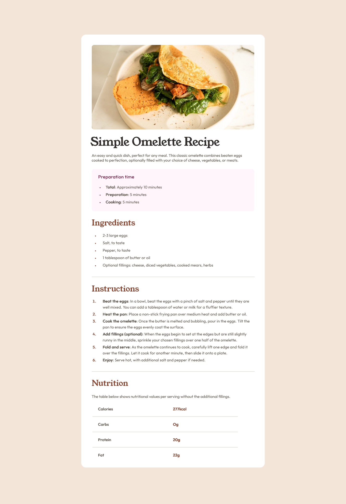

# Frontend Mentor - Recipe page solution

This is a solution to the [Recipe page challenge on Frontend Mentor](https://www.frontendmentor.io/challenges/recipe-page-KiTsR8QQKm). Frontend Mentor challenges help you improve your coding skills by building realistic projects.

## Table of contents

- [Overview](#overview)
  - [The challenge](#the-challenge)
  - [Screenshot](#screenshot)
  - [Links](#links)
- [My process](#my-process)
  - [Built with](#built-with)
  - [What I learned](#what-i-learned)
  - [Continued development](#continued-development)
  - [Useful resources](#useful-resources)
- [Author](#author)
- [Acknowledgments](#acknowledgments)

## Overview

- This is a solution to the Recipe page challenge on Frontend Mentor. This is a newbie challenge. To do this challenge, you need a basic understanding of HTML and CSS. I have tried to get the solution looking as close to the design as possible

### The Challenge

- Our challenge is to build out this recipe page and get it looking as close to the design as possible.
  You can use any tools you like to help you complete the challenge. So if you've got something you'd like to practice, feel free to give it a go.

### Screenshot



### Links

- Frontend Mentor Solution URL: (https://www.frontendmentor.io/solutions/fmnewbie-challengesrecipe-page-main-rjfgxnWjPw)
- Live Site URL: (https://noura201.github.io/Frontend_Mentor_01_Recipe_Page_Main_Challenge/)
- MyPersonal Linkedin URL: (https://www.linkedin.com/in/noura-mamdouh-8a81982a4/)

## My process

### Built with

- Semantic HTML5 markup
- CSS custom properties

### What I learned

I have learned more while working through this project such as:

- Dealing with images and specifing some properties such as img [width - height].
  Code:

```html

```

- Dealing with headers and specifing some properties such as font [family-weight-size], text-shadow, letter-spacing, word-spacing, and color.
  Code:

```css
.main-head-h1 {
  font-family: "young-serif";
  font-size: xxx-large;
  font-weight: 100;
  margin-left: -6px;
  margin-top: 2%;
  letter-spacing: -0.08rem;
  word-spacing: 0.02rem;
  color: hsl(24, 5%, 18%);
}
```

- Dealing with lists weather Ordered/Unordered One.
  Code:

```html
<ul class="preparation-time-ulist">
  <li><span>Total</span>: Approximately 10 minutes</li>
  <li><span>Preparation</span>: 5 minutes</li>
  <li><span>Cooking</span>: 5 minutes</li>
</ul>
```

- Dealing with List-Marker and specifing some properties for it.
  Code:

```css
.preparation-time-ulist ::marker {
  font-size: 10.5px;
  color: hsl(332, 51%, 32%);
}
```

- Dealing with hr [Horizontal-Role] and specifing some properties for it such as width and border.
  Code:

```css
hr {
  width: 100%;
  border: 0.1px solid hsl(30, 18%, 87%);
}
```

### Continued development

- I would like to train more about grouping multiple selectors perfectly to write a clean code and save more time and effort.
- I want to learn more about the important CSS Properties: Grid - Flexbox.
- I'm seeking to do more realistic projects to improve my coding skills.

### Useful resources

- When I faced an obstacle, I have searched on chatgpt to help me solve my problem.

## Author

- Github - [@NouraMamdouh](https://github.com/Noura201)
- Frontend Mentor - [@NouraMamdouh](https://www.frontendmentor.io/profile/Noura201)
- Linkedin - [@noura mamdouh](https://www.linkedin.com/in/noura-mamdouh-8a81982a4/)

## Acknowledgments

- I really have completed this challenge by myself.
